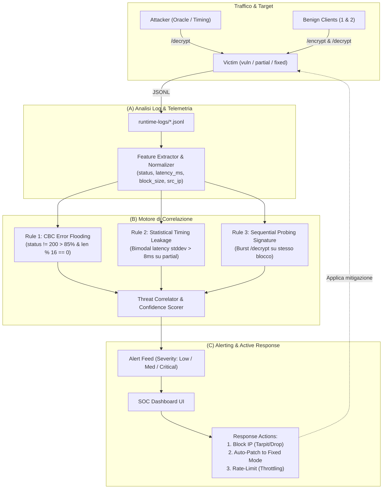

# SOC Layer Architecture & Detection Engine — Phase 2 One-Pager

## Problem Statement
> **How Might We** trasformare il laboratorio Padding Oracle da un semplice esercizio crittografico in una piattaforma didattica SOC completa, in grado di illustrare visivamente l'analisi dei log, la correlazione multi-segnale (error-rate e timing side-channel) e la risposta agli incidenti in tempo reale per una presentazione accademica?

---

## Recommended Direction: "SOC Hybrid Cryptographic Telemetry & Response"

La direzione raccomandata struttura il livello SOC come un sistema di monitoraggio e difesa a 3 componenti strettamente integrate con il backend e la dashboard:

---

## I 3 Pilastri di Implementazione

### 1. (A) Analisi Log (Log Analysis & Feature Extraction)
- **Log Enrichment in `soc/collector.py`**:
  - Estrazione finestre temporali mobili configurabili (30s, 1m, 5m, 15m).
  - Profilazione Baseline automatica: metriche dei client benigni (`benign-1`, `benign-2`) usate come riferimento normale (error-rate < 2%, latenza media stabile ~2-5ms, inter-arrival time distribuito).
  - Metriche crittografiche estratte: `ciphertext_len`, conformità a blocchi AES (16 byte), rapporto tra chiamate `/encrypt` e `/decrypt`.

### 2. (B) Correlazione & Regole di Detection (Hybrid Detection Engine)
- **Regola 1 — High Error-Rate Padding Oracle (per `victim-vuln`)**:
  - Rileva burst di richieste `/decrypt` da un singolo `src_ip` con `status != 200` > 85% e volume > 20 richieste/finestra.
  - *MITRE ATT&CK*: `T1110.001` (Brute Force) & `T1499` (Endpoint Denial/Probing).
- **Regola 2 — Timing Side-Channel Correlation (per `victim-partial`)**:
  - Anche quando la vittima ritorna sempre `403 Request Denied` generico, calcola la varianza e la bimodalità delle latenze.
  - Rileva pattern di latenza (richieste a ~5ms per padding errato vs ~35ms per padding valido), identificando l'attaccante che sfrutta il side-channel temporale.
- **Regola 3 — Cryptographic Attack Progress Correlation**:
  - Correla la telemetria della vittima con i checkpoint dell'attaccante (`attack_progress` / `attack_complete`), calcolando il tempo medio di rilevamento (*MTTD - Mean Time To Detect*).

### 3. (C) Alerting & Active Response (SOC Triage & Playbooks)
- **Feed Alert Interattivo nella UI**:
  - Tabella alert real-time con badge di severità, IP sorgente, regola scattata, confidenza e timestamp.
  - Drill-down con 1-click: visualizzazione log associati e mini-grafico di distribuzione latenze/errori.
- **Pulsanti di Risposta Immediata (Playbook)**:
  - 🛡️ **Hot-Patch to Fixed**: Commuta al volo la vittima su `victim-fixed` (mitigazione crittografica).
  - 🚫 **Block IP**: Blocca temporaneamente le richieste dell'IP rilevato (emulando un WAF/Firewall).
  - ⏱️ **Apply Rate Limiting**: Inietta ritardo artificiale (tarpit) sulle chiamate `/decrypt` per neutralizzare l'efficienza dell'attacco.

---

## Key Assumptions to Validate
- [ ] **Timing Detection Stability**: La differenza di ~30ms in `victim-partial` è statisticamente distinguibile dal jitter di rete di Docker. (*Test: eseguire 100 richieste benigne vs 100 richieste attacker su host locale*).
- [ ] **Zero False Positives con Baseline**: I client benigni che inviano richieste legittime non devono mai far scattare gli alert ad alta severità (*Test: benchmark con 2 client benigni a 10 req/s*).
- [ ] **Latenza del Collector**: Il calcolo delle correlazioni e metriche in `collector.py` non deve impiegare più di 50ms per mantenere la UI fluida in polling (2s).

---

## MVP Scope (Cosa includiamo subito)
- **Collector (`soc/collector.py`)**:
  - Implementazione delle 2 regole di correlazione primarie (Error Rate + Timing Variance).
  - Endpoint `/alerts` arricchito con dettagli forensi (IP, evidence, metriche, suggerimento di remediation).
  - Endpoint `/metrics` con calcolo MTTD e True/False Positive rate.
- **Dashboard (`soc/dashboard.py`)**:
  - Sezione dedicata "SOC Alert Feed & Correlation Matrix" nella pagina principale.
  - Grafico visivo con rapporto Errori/Successi e Latenza per IP.
  - Azioni di risposta rapida: Pulsante "Mitiga (Switch Fixed)", "Blocca Attaccante", "Reset Log".
- **Regole Configurabili (`control/alert_rules.json`)**:
  - Parametri esposti: soglie di errore, soglia timing stddev, finestra temporale.

---

## Not Doing (and Why)
- **Full SIEM Stack esterno (Elasticsearch / Wazuh / Splunk)**: Troppo pesante per una demo accademica locale; Flask + JSONL + in-memory analytics è istantaneo, portabile e trasparente da spiegare a un docente.
- **AI / Machine Learning Anomaly Detection**: L'attacco Padding Oracle ha una firma crittografica e statistica precisa e deterministica; l'euristica statistica (varianza e soglie) è 100% spiegabile formalmente durante l'esame.
- **WAF Hardware o iptables complessi**: La mitigazione a livello container/applicazione (Hot-patch e rate-limiting) è sufficiente, pulita e visivamente d'impatto.
