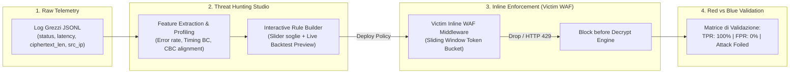

# SOC Threat Hunting & Inline WAF Prevention Engine — Idea One-Pager

## Problem Statement
> **How Might We** trasformare il laboratorio da un sistema a regole statiche in una piattaforma interattiva di **Threat Hunting & Rule Engineering**, dove l'utente estrae dai log grezzi i pattern dell'attacco crittografico, costruisce e testa dinamicamente regole di detection con preview live, e le applica come policy di firewalling preventivo (WAF) direttamente nel container vittima per neutralizzare l'exploit?

---

## Recommended Direction: "Interactive Threat Hunting to Inline WAF Enforcement"

La direzione scelta struttura il laboratorio attorno al **ciclo di vita reale di un Threat Hunter / Detection Engineer nel SOC**:

### Componenti Chiave del Flusso:

1. **Raw Log Explorer & Feature Extractor**:
   - Invece di nascondere i dati, la dashboard offre una vista tabellare/grafica dei log grezzi raccolti da `benign-1`, `benign-2`, `attacker` e `victim`.
   - Evidenzia le feature crittografiche chiave: `status_code`, `fail_rate`, `latency_ms` (e Sarle's $BC$), `ciphertext_len` (allineamento 16-byte CBC).

2. **Rule Engineering Studio & Backtest Preview**:
   - L'analista può creare una regola personalizzata regolando i parametri (es. soglia fail rate, volume minimo, dispersione latenza).
   - **Live Backtest**: L'interfaccia mostra istantaneamente l'impatto sui log esistenti (*"Questa regola rileva 100% dell'IP attacker e 0% dei client benigni"*).

3. **Inline WAF Middleware nel Container Victim**:
   - Il container vittima integra un layer WAF (interceptor a livello Flask/WSGI).
   - Quando una richiesta arriva su `/decrypt`, il WAF verifica la sliding window dell'IP sorgente rispetto alla policy attiva.
   - Se l'IP viola la regola, il WAF risponde immediatamente con `HTTP 429 Too Many Requests` (o `403 Forbidden - WAF Block`) **prima** che la funzione crittografica `verify_and_extract()` venga invocata.
   - Il container genera un evento di log specifico `waf_blocked`.

4. **Storyline d'Esame "Red vs Blue in 4 Atti"**:
   - **Atto 1 (Exploit Riuscito)**: Senza WAF, l'attaccante decifra il token AES-CBC ed estrae il segreto in ~30-60 secondi.
   - **Atto 2 (Threat Hunting)**: L'analista apre i log grezzi, individua l'anomalia statistica e formula la regola di blocco.
   - **Atto 3 (Deploy Regola WAF)**: La regola viene salvata e caricata nel middleware della vittima.
   - **Atto 4 (Exploit Neutralizzato)**: L'attacco viene rieseguito; dopo i primi $N$ tentativi di probing, il WAF scatta, isola l'IP e blocca l'attacco (messaggio segreto protetto).

---

## Key Assumptions to Validate
- [ ] **WAF Performance Overhead**: Il middleware di ispezione sliding-window nel container vittima deve avere una latenza $< 0.1\text{ ms}$ per non degradare il throughput dei client benigni.
- [ ] **Zero False Positives con Client Benigni**: Il traffico benigno a 10 req/s non deve mai raggiungere la soglia di blocco WAF.
- [ ] **Feedback Visivo Immediato**: Lo switch tra stato "WAF Inattivo (Vulnerabile)" e "WAF Attivo (Protetto)" deve riflettersi istantaneamente nella topologia di rete visiva e nello stream dei log.

---

## MVP Scope (Cosa implementiamo)
- **Container Victim (`victim/app.py`)**:
  - Middleware WAF con sliding window (conteggio tentativi ed errori recenti per IP).
  - Endpoint `/waf/policy` per aggiornare al volo le soglie di blocco senza riavviare il container.
  - Risposta con `HTTP 429 Too Many Requests` e logging evento `waf_blocked`.
- **SOC Collector (`soc/collector.py`)**:
  - Endpoint `/hunting/backtest` per simulare l'applicazione di una regola su un dataset di log e calcolare $TPR$ e $FPR$.
- **Dashboard UI (`soc/dashboard.py`)**:
  - Tab dedicata **"🎯 Threat Hunting & WAF Studio"**.
  - Wizard a 3 step: *1. Analisi Log Grezzi $\to$ 2. Tuning Regola con Preview $\to$ 3. Attivazione WAF*.
  - Indicatore di stato WAF sul nodo Victim (badge "🛡️ WAF PROTECTED").
- **Esportazione Regola Sigma**:
  - Generazione della regola compilata in formato **Sigma Rule (YAML)** per la relazione accademica.

---

## Not Doing (and Why)
- **Proxy inverso esterno separato (Nginx / Envoy / ModSecurity)**: Aggiungere un container WAF separato aumenterebbe la complessità di rete e il carico Docker senza valore didattico aggiunto. Il middleware integrato in `victim/app.py` mostra chiaramente la logica di difesa applicativa L7 in modo trasparente e spiegabile riga per riga al docente.
- **Machine Learning Black-Box per Anomaly Detection**: L'attacco Padding Oracle ha una signature statistico-crittografica deterministica (proporzione errori e blocchi di 16 byte); usare un'euristica rule-based è al 100% spiegabile e formalizzabile per l'esame.

---

## Schema Didattico per la Presentazione d'Esame

| Fase della Demo | Azione | Risultato Visivo / Dimostrazione al Docente |
|---|---|---|
| **1. Baseline** | Avvio benign-1 e benign-2 | Log regolari, 0 errori, latenza ~1-2ms, WAF inerte |
| **2. Red Team Attack** | Lancio `attacker` su AES-CBC | Attacco ha successo, estrazione byte-by-byte del testo in chiaro |
| **3. Threat Hunting** | Apertura "Hunting Studio" | Mostra log grezzi: 98% fail-rate, burst `/decrypt` su blocchi 16B |
| **4. Rule Creation & Backtest** | Tuning soglia e verifica | Preview live: TPR = 100%, FPR = 0% sui dati storici |
| **5. WAF Deployment** | Deploy su Victim con 1 click | Badge "WAF ACTIVE", policy applicata al middleware |
| **6. Attack Foiled** | Rilancio dell'attacco | Dopo 15 richieste l'IP viene bloccato (HTTP 429), attacco fallisce |
